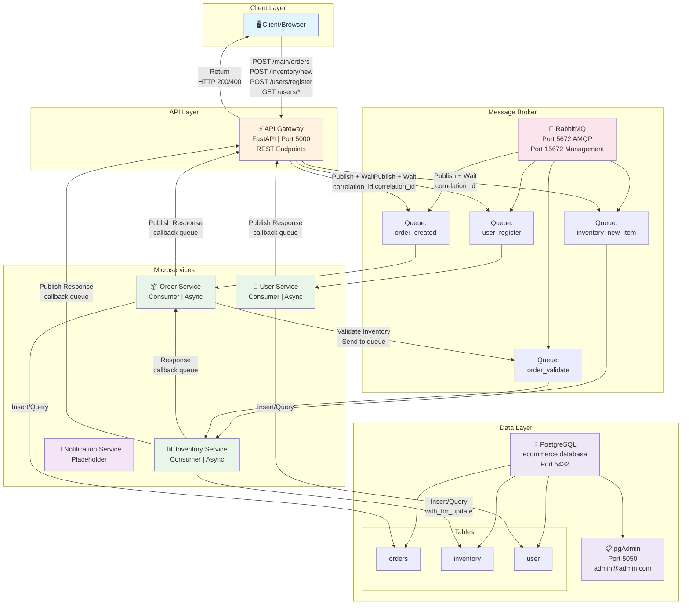

# E-Commerce System - Overall Architecture

```mermaid
graph TB
    subgraph "Client Layer"
        CLIENT["🖥️ Client/Browser"]
    end

    subgraph "API Layer"
        API["⚡ API Gateway<br/>FastAPI | Port 5000<br/>REST Endpoints"]
    end

    subgraph "Message Broker"
        RMQ["🐰 RabbitMQ<br/>Port 5672 AMQP<br/>Port 15672 Management"]
        Q1["Queue:<br/>order_created"]
        Q2["Queue:<br/>inventory_new_item"]
        Q3["Queue:<br/>user_register"]
        Q4["Queue:<br/>order_validate"]
        RMQ --> Q1
        RMQ --> Q2
        RMQ --> Q3
        RMQ --> Q4
    end

    subgraph "Microservices"
        OS["📦 Order Service<br/>Consumer | Async"]
        IS["📊 Inventory Service<br/>Consumer | Async"]
        US["👤 User Service<br/>Consumer | Async"]
        NS["📧 Notification Service<br/>Placeholder"]
    end

    subgraph "Data Layer"
        DB["🗄️ PostgreSQL<br/>ecommerce database<br/>Port 5432"]
        ADMIN["📋 pgAdmin<br/>Port 5050<br/>admin@admin.com"]

        subgraph "Tables"
            T1["orders"]
            T2["inventory"]
            T3["user"]
        end

        DB --> T1
        DB --> T2
        DB --> T3
    end

    CLIENT -->|"POST /main/orders<br/>POST /inventory/new<br/>POST /users/register<br/>GET /users/*"| API

    API -->|"Publish + Wait<br/>correlation_id"| Q1
    API -->|"Publish + Wait<br/>correlation_id"| Q2
    API -->|"Publish + Wait<br/>correlation_id"| Q3

    Q1 --> OS
    Q2 --> IS
    Q3 --> US

    OS -->|"Validate Inventory<br/>Send to queue"| Q4
    Q4 --> IS
    IS -->|"Response<br/>callback queue"| OS

    OS -->|"Insert/Query"| T1
    IS -->|"Insert/Query<br/>with_for_update"| T2
    US -->|"Insert/Query"| T3

    OS -->|"Publish Response<br/>callback queue"| API
    IS -->|"Publish Response<br/>callback queue"| API
    US -->|"Publish Response<br/>callback queue"| API

    API -->|"Return<br/>HTTP 200/400"| CLIENT

    DB --> ADMIN

    style CLIENT fill:#e1f5ff
    style API fill:#fff3e0
    style RMQ fill:#fce4ec
    style OS fill:#e8f5e9
    style IS fill:#e8f5e9
    style US fill:#e8f5e9
    style NS fill:#f3e5f5
    style DB fill:#ede7f6
    style ADMIN fill:#ede7f6
```
