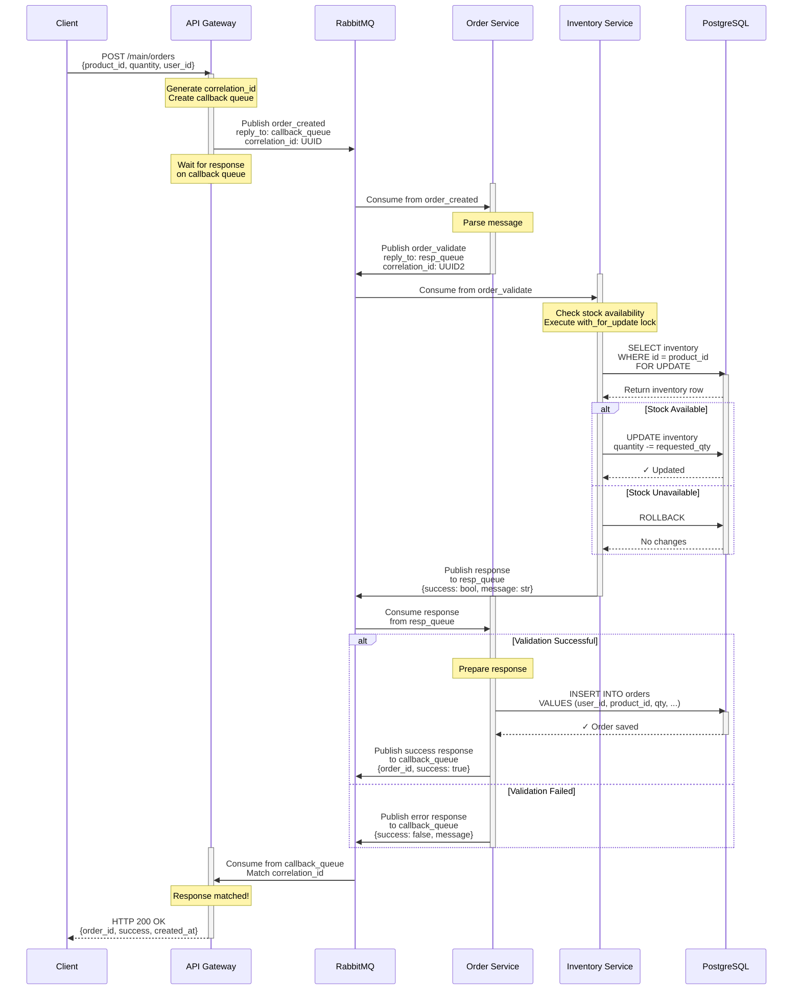

# Order Creation - Request-Reply Message Flow

```mermaid
sequenceDiagram
    participant Client
    participant API Gateway
    participant RabbitMQ
    participant Order Service
    participant Inventory Service
    participant PostgreSQL

    Client->>API Gateway: POST /main/orders<br/>{product_id, quantity, user_id}
    activate API Gateway

    Note over API Gateway: Generate correlation_id<br/>Create callback queue
    API Gateway->>RabbitMQ: Publish order_created<br/>reply_to: callback_queue<br/>correlation_id: UUID

    Note over API Gateway: Wait for response<br/>on callback queue
    deactivate API Gateway

    activate Order Service
    RabbitMQ->>Order Service: Consume from order_created
    Note over Order Service: Parse message

    Order Service->>RabbitMQ: Publish order_validate<br/>reply_to: resp_queue<br/>correlation_id: UUID2
    deactivate Order Service

    activate Inventory Service
    RabbitMQ->>Inventory Service: Consume from order_validate
    Note over Inventory Service: Check stock availability<br/>Execute with_for_update lock

    Inventory Service->>PostgreSQL: SELECT inventory<br/>WHERE id = product_id<br/>FOR UPDATE
    activate PostgreSQL
    PostgreSQL-->>Inventory Service: Return inventory row

    alt Stock Available
        Inventory Service->>PostgreSQL: UPDATE inventory<br/>quantity -= requested_qty
        PostgreSQL-->>Inventory Service: ✓ Updated
    else Stock Unavailable
        Inventory Service->>PostgreSQL: ROLLBACK
        PostgreSQL-->>Inventory Service: No changes
    end
    deactivate PostgreSQL

    Inventory Service->>RabbitMQ: Publish response<br/>to resp_queue<br/>{success: bool, message: str}
    deactivate Inventory Service

    activate Order Service
    RabbitMQ->>Order Service: Consume response<br/>from resp_queue

    alt Validation Successful
        Note over Order Service: Prepare response
        Order Service->>PostgreSQL: INSERT INTO orders<br/>VALUES (user_id, product_id, qty, ...)
        activate PostgreSQL
        PostgreSQL-->>Order Service: ✓ Order saved
        deactivate PostgreSQL
        Order Service->>RabbitMQ: Publish success response<br/>to callback_queue<br/>{order_id, success: true}
    else Validation Failed
        Order Service->>RabbitMQ: Publish error response<br/>to callback_queue<br/>{success: false, message}
    end
    deactivate Order Service

    activate API Gateway
    RabbitMQ->>API Gateway: Consume from callback_queue<br/>Match correlation_id
    Note over API Gateway: Response matched!
    API Gateway-->>Client: HTTP 200 OK<br/>{order_id, success, created_at}
    deactivate API Gateway
```
