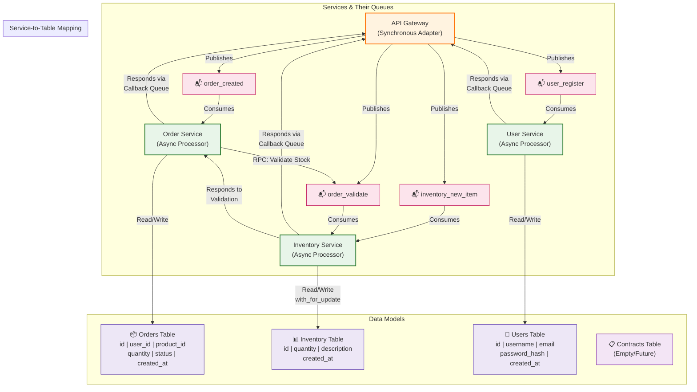

# Service Dependencies & Message Flows

```mermaid
graph TB
    subgraph "Services & Their Queues"
        direction LR
        APIGW["API Gateway<br/>(Synchronous Adapter)"]

        APIGW -->|Publishes| Q1["📬 order_created"]
        APIGW -->|Publishes| Q2["📬 inventory_new_item"]
        APIGW -->|Publishes| Q3["📬 user_register"]
        APIGW -->|Publishes| Q4["📬 order_validate"]

        Q1 -->|Consumes| OS["Order Service<br/>(Async Processor)"]
        Q2 -->|Consumes| IS["Inventory Service<br/>(Async Processor)"]
        Q3 -->|Consumes| US["User Service<br/>(Async Processor)"]
        Q4 -->|Consumes| IS

        OS -->|Responds via<br/>Callback Queue| APIGW
        IS -->|Responds via<br/>Callback Queue| APIGW
        US -->|Responds via<br/>Callback Queue| APIGW

        OS -->|RPC: Validate Stock| Q4
        IS -->|Responds to<br/>Validation| OS
    end

    subgraph "Data Models"
        direction TB
        ORDERS["📦 Orders Table<br/>id | user_id | product_id<br/>quantity | status | created_at"]
        INVENTORY["📊 Inventory Table<br/>id | quantity | description<br/>created_at"]
        USERS["👤 Users Table<br/>id | username | email<br/>password_hash | created_at"]
        CONTRACTS["📋 Contracts Table<br/>(Empty/Future)"]
    end

    subgraph "Service-to-Table Mapping"
        OS -->|Read/Write| ORDERS
        IS -->|Read/Write<br/>with_for_update| INVENTORY
        US -->|Read/Write| USERS
    end

    style APIGW fill:#fff3e0,stroke:#ff6f00,stroke-width:2px
    style OS fill:#e8f5e9,stroke:#2e7d32,stroke-width:2px
    style IS fill:#e8f5e9,stroke:#2e7d32,stroke-width:2px
    style US fill:#e8f5e9,stroke:#2e7d32,stroke-width:2px
    style Q1 fill:#fce4ec,stroke:#c2185b
    style Q2 fill:#fce4ec,stroke:#c2185b
    style Q3 fill:#fce4ec,stroke:#c2185b
    style Q4 fill:#fce4ec,stroke:#c2185b
    style ORDERS fill:#ede7f6,stroke:#512da8
    style INVENTORY fill:#ede7f6,stroke:#512da8
    style USERS fill:#ede7f6,stroke:#512da8
    style CONTRACTS fill:#f3e5f5,stroke:#7b1fa2
```
