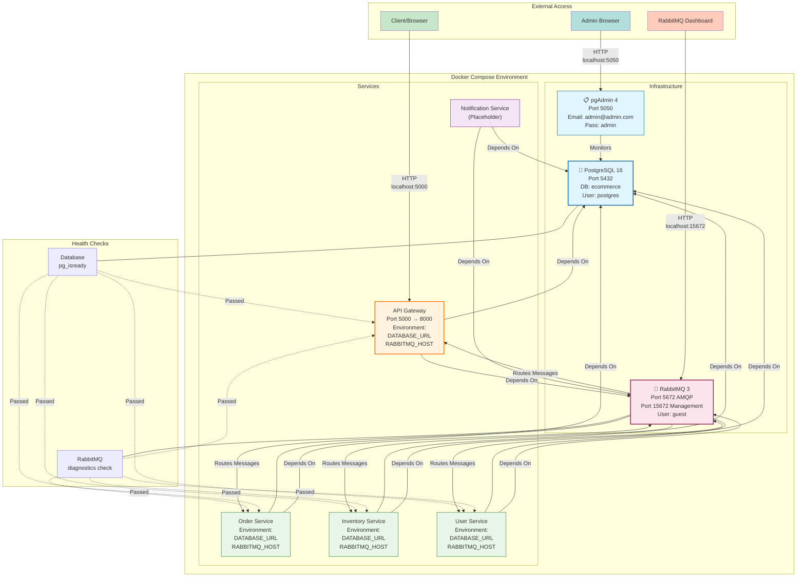

# Deployment Architecture - Docker Compose

```mermaid
graph TB
    subgraph "Docker Compose Environment"
        subgraph "Infrastructure"
            DB["🐘 PostgreSQL 16<br/>Port 5432<br/>DB: ecommerce<br/>User: postgres"]

            ADMIN["📋 pgAdmin 4<br/>Port 5050<br/>Email: admin@admin.com<br/>Pass: admin"]

            RMQ["🐰 RabbitMQ 3<br/>Port 5672 AMQP<br/>Port 15672 Management<br/>User: guest"]
        end

        subgraph "Services"
            APIGW["API Gateway<br/>Port 5000 → 8000<br/>Environment:<br/>DATABASE_URL<br/>RABBITMQ_HOST"]

            OS["Order Service<br/>Environment:<br/>DATABASE_URL<br/>RABBITMQ_HOST"]

            IS["Inventory Service<br/>Environment:<br/>DATABASE_URL<br/>RABBITMQ_HOST"]

            US["User Service<br/>Environment:<br/>DATABASE_URL<br/>RABBITMQ_HOST"]

            NS["Notification Service<br/>(Placeholder)"]
        end

        APIGW -->|Depends On| DB
        APIGW -->|Depends On| RMQ

        OS -->|Depends On| DB
        OS -->|Depends On| RMQ

        IS -->|Depends On| DB
        IS -->|Depends On| RMQ

        US -->|Depends On| DB
        US -->|Depends On| RMQ

        NS -->|Depends On| DB
        NS -->|Depends On| RMQ

        ADMIN -->|Monitors| DB

        RMQ -->|Routes Messages| APIGW
        RMQ -->|Routes Messages| OS
        RMQ -->|Routes Messages| IS
        RMQ -->|Routes Messages| US
    end

    subgraph "External Access"
        CLIENT["Client/Browser"]
        DBADMIN["Admin Browser"]
        RMQADMIN["RabbitMQ Dashboard"]
    end

    CLIENT -->|HTTP<br/>localhost:5000| APIGW
    DBADMIN -->|HTTP<br/>localhost:5050| ADMIN
    RMQADMIN -->|HTTP<br/>localhost:15672| RMQ

    subgraph "Health Checks"
        HC1["Database<br/>pg_isready"]
        HC2["RabbitMQ<br/>diagnostics check"]
    end

    DB --- HC1
    RMQ --- HC2

    HC1 -.->|Passed| APIGW
    HC1 -.->|Passed| OS
    HC1 -.->|Passed| IS
    HC1 -.->|Passed| US

    HC2 -.->|Passed| APIGW
    HC2 -.->|Passed| OS
    HC2 -.->|Passed| IS
    HC2 -.->|Passed| US

    style DB fill:#e1f5fe,stroke:#01579b,stroke-width:2px
    style ADMIN fill:#e1f5fe,stroke:#01579b
    style RMQ fill:#fce4ec,stroke:#880e4f,stroke-width:2px
    style APIGW fill:#fff3e0,stroke:#ff6f00,stroke-width:2px
    style OS fill:#e8f5e9,stroke:#2e7d32
    style IS fill:#e8f5e9,stroke:#2e7d32
    style US fill:#e8f5e9,stroke:#2e7d32
    style NS fill:#f3e5f5,stroke:#7b1fa2
    style CLIENT fill:#c8e6c9
    style DBADMIN fill:#b2dfdb
    style RMQADMIN fill:#ffccbc
```
